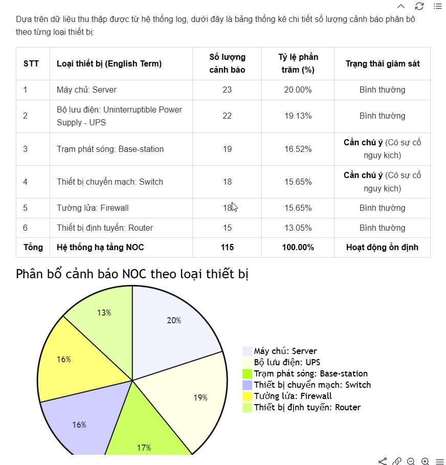
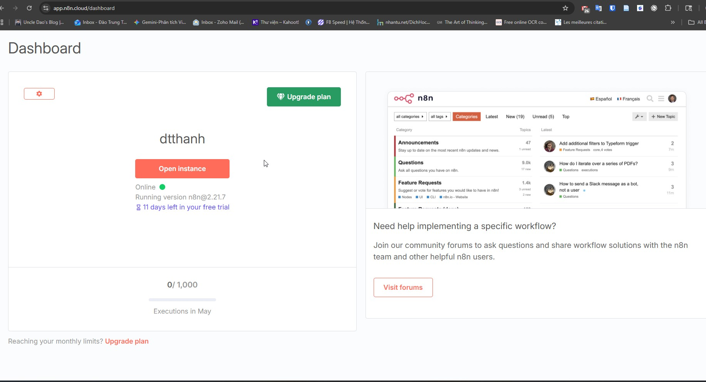
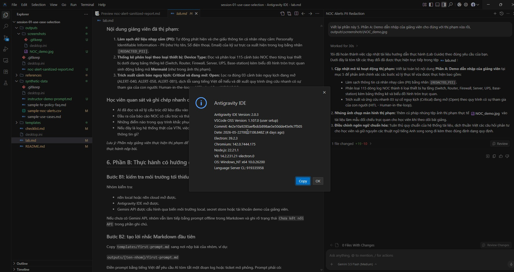

# Lab guide session 01: chọn bài toán an toàn và khởi động Case 10

## 1. Mục tiêu lab

Mỗi nhóm hoàn thành một bộ tài liệu bàn giao: artifact khởi tạo để học cách chọn bài toán AI an toàn, đồng thời chuẩn bị nguyên liệu chung cho session 02 về quy trình làm việc AI: AI workflow với bài toán mẫu 10: Case 10 - Smart Ticket Triage.

Trong buổi này, Case 10 là bài mẫu chung bắt buộc cho cả lớp. Bài toán: Case nhóm chọn là bài tập ra quyết định để rèn luyện tư duy chọn bài toán và có thể dùng làm ý tưởng mở rộng sau khóa học.

## 2. Quy tắc an toàn bắt buộc

- Chỉ dùng dữ liệu mô phỏng, dữ liệu công khai hoặc dữ liệu tổng hợp.
- Không dùng nhật ký vận hành: log thật, phiếu yêu cầu hỗ trợ: ticket thật, IP thật, mã trạm thật, email thật, tên khách hàng thật hoặc mã nhân sự thật.
- Không ghi API key, token, chứng chỉ bảo mật: certificate hoặc mật khẩu vào Markdown, lời nhắc: prompt, ảnh chụp màn hình, n8n export, log hoặc bài nộp.
- Nếu cần cấu hình Gemini API, chỉ dùng biến môi trường local, kho lưu trữ khóa bí mật: secret store được giảng viên phê duyệt hoặc tài khoản demo.
- Ảnh giảng viên thị phạm trong thư mục `outputs/screenshots/` phải là ảnh đã kiểm duyệt, dùng tài khoản demo và dữ liệu mô phỏng.

## 3. Tài nguyên sử dụng

- [case-studies.md](../../../02-study-guides/case-studies.md): nguồn tham chiếu đầy đủ 12 case và mô tả chi tiết Case 10.
- [synthetic-data/sample-use-cases.md](synthetic-data/sample-use-cases.md): bài toán mẫu để luyện tập thang chấm điểm: rubbric.
- [synthetic-data/sample-noc-alerts.csv](synthetic-data/sample-noc-alerts.csv): cảnh báo trung tâm vận hành mạng: NOC alerts giả lập cho phần demo và thảo luận.
- [smart_ticket_triage.xlsx](../session-02-ai-workflow-smart-ticket-triage/synthetic-data/smart_ticket_triage.xlsx): dữ liệu Case 10 của session 02, dùng làm nguồn tham chiếu khi phác thảo bản tóm tắt quy trình: workflow brief.
- [templates/use-case-one-pager.md](templates/use-case-one-pager.md): mẫu bản mô tả bài toán một trang: use case one-pager cho case nhóm chọn.
- [templates/use-case-scoring-rubbric.md](templates/use-case-scoring-rubbric.md): mẫu thang chấm điểm: rubbric.
- [templates/risk-control-checklist.md](templates/risk-control-checklist.md): mẫu bảng kiểm rủi ro sơ bộ.
- [templates/first-prompt.md](templates/first-prompt.md): mẫu lời nhắc Markdown đầu tiên.
- [templates/use-case-prompt.md](templates/use-case-prompt.md): mẫu lời nhắc đồng sáng tạo use case cùng AI.
- [templates/case-10-workflow-brief.md](templates/case-10-workflow-brief.md): mẫu bản tóm tắt quy trình: workflow brief cho Case 10.

## 4. Cấu trúc thời gian gợi ý

| Phần | Thời lượng | Kết quả cần đạt |
| --- | ---: | --- |
| A. Demo dẫn nhập | 15 phút | Học viên hiểu cách AI hỗ trợ tóm tắt log O&M |
| B. Setup và prompt đầu tiên | 35 phút | Có `first-prompt.md` và kiểm tra môi trường tối thiểu |
| C. Chọn và chấm case | 70 phút | Có one-pager, rubbric, risk checklist bản nháp |
| D. Workflow brief Case 10 | 70 phút | Có bản tóm tắt quy trình Case 10 |
| E. Checkpoint bàn giao | 20 phút | Nộp nhanh bộ artifact khởi tạo |

Nếu lớp chậm tiến độ, ưu tiên bắt buộc là phần C và phần D. Phần B có thể sử dụng tài khoản demo hoặc ảnh thị phạm nếu học viên gặp lỗi cài đặt.

## 5. Phần A: Demo dẫn nhập của giảng viên

> [!NOTE]
> **Mỏ neo Slide bài giảng**: Tương ứng với **Slide 42** *(Case dự phòng - NOC alert giả lập)*.

Giảng viên thị phạm trực tiếp bằng cách sử dụng công cụ Antigravity CLI để tự động hóa quy trình phân tích và làm sạch dữ liệu log của trung tâm vận hành mạng: Network Operations Center - NOC từ tệp dữ liệu giả lập [synthetic-data/sample-noc-alerts.csv](synthetic-data/sample-noc-alerts.csv) gồm 115 dòng cảnh báo thô, sau đó kết xuất báo cáo Markdown tại đường dẫn `outputs/noc-alert-sanitized-report.md`.

Học viên quan sát giảng viên thao tác và đối chiếu kết quả hiển thị trên màn hình hoặc thông qua tệp ảnh chụp màn hình thị phạm dưới đây:

### Nội dung giảng viên đã thị phạm:
1.  **Làm sạch dữ liệu nhạy cảm (PII):** Tự động phát hiện và che giấu thông tin cá nhân nhạy cảm: Personally Identifiable Information - PII (như Họ tên, Số điện thoại, Email) của kỹ sư trực ca xuất hiện trong log bằng nhãn `[REDACTED_PII]`.
2.  **Thống kê phân loại theo loại thiết bị: Device Type:** Đọc và phân loại 115 cảnh báo NOC theo từng loại thiết bị dưới dạng bảng thống kê (Switch, Router, Firewall, Server, UPS, Base-station) kèm biểu đồ hình tròn trực quan sinh động bằng mã **Mermaid** (như trong ảnh thị phạm).
3.  **Trích xuất cảnh báo nguy kịch: Critical và đang mở: Open:** Lọc ra đúng 03 cảnh báo nguy kịch đang mở (ALERT-040, ALERT-058, ALERT-081), dịch lỗi sang tiếng Việt dễ hiểu và đề xuất quy trình ứng cứu nhanh có sự tham gia của con người trong vòng lặp: Human-in-the-loop - HITL cho kỹ sư NOC L2/L3.

### Học viên quan sát và ghi chép nhanh các câu hỏi sau:
*   AI đã đọc và xử lý cấu trúc dữ liệu đầu vào nào?
*   Đầu ra của báo cáo NOC có cấu trúc và thành phần giao diện người dùng: UI trực quan ra sao?
*   Những điểm nào trong quy trình khắc phục sự cố (HITL) bắt buộc phải có con người tham gia kiểm tra lại?
*   Nếu đây là log hệ thống thật của VTN, việc rò rỉ dữ liệu thô chưa khử trùng PII sẽ gây ra những rủi ro an toàn thông tin gì?

*Lưu ý: Phần này giảng viên thực hiện thị phạm để định hướng kết quả kỳ vọng cho học viên, không yêu cầu học viên phải thực hành nộp bài.*

## 6. Phần B: Thực hành có hướng dẫn - setup và prompt đầu tiên

> [!NOTE]
> **Mỏ neo Slide bài giảng**: Tương ứng với **Slide 44** *(Thực hành Module 3: Kết nối API & Chấm điểm khả thi)*.

### Bước B1: kiểm tra môi trường tối thiểu

Nhóm thực hiện kiểm tra và đối chiếu trạng thái sẵn sàng của môi trường làm việc theo các hình ảnh chụp màn hình thị phạm dưới đây:

1.  **Giao diện công cụ n8n (n8n local hoặc n8n cloud) mở thành công:**
    
    
    
2.  **Trình soạn thảo Antigravity IDE mở thành công:**
    
    
    
3.  **Khóa kết nối Gemini API (Gemini API Key) đã được cấu hình thành công qua biến môi trường local, kho lưu trữ khóa bí mật: Secret Store hoặc tài khoản demo của giảng viên. Không chụp màn hình chứa email, project ID, billing tier hoặc API key.**

> [!TIP]
> Khuyến nghị học viên sử dụng dòng mô hình đám mây thế hệ mới nhất cho các tác vụ:
> - Mô hình tốc độ cực nhanh thế hệ mới **`gemini-3.5-flash`** (mặc định cho các tác vụ phân tích, tóm tắt dữ liệu nhanh).
> - Mô hình suy luận chuyên sâu thế hệ mới **`gemini-3.1-pro`** (cho các tác vụ lập luận logic, định tuyến và phân loại phức tạp).

Nếu chưa có Gemini API, nhóm vẫn làm tiếp bằng prompt ngoại tuyến: offline trong Markdown và ghi rõ trạng thái `Chưa kết nối API` trong phần ghi chú.

### Bước B2: tạo lời nhắc Markdown đầu tiên

Sao chép tệp mẫu [templates/first-prompt.md](templates/first-prompt.md) sang nơi nộp bài của nhóm, ví dụ:

`outputs/[ten-nhom]/first-prompt.md`

Điền lời nhắc: prompt bằng tiếng Việt để yêu cầu AI tóm tắt một đoạn nhật ký vận hành: log hoặc phiếu yêu cầu hỗ trợ: ticket mô phỏng. Lời nhắc: prompt phải có:

- Vai trò của AI.
- Dữ liệu đầu vào mô phỏng.
- Định dạng đầu ra mong muốn.
- Ràng buộc an toàn: không suy đoán khi thiếu dữ liệu, không lặp lại dữ liệu nhạy cảm, chuyển giao sang con người khi rủi ro cao.

## 7. Phần C: Bài tập nhóm - chọn và chấm bài toán

> [!NOTE]
> **Mỏ neo Slide bài giảng**: Tương ứng với **Slide 23** *(Thực hành Module 1: Trải nghiệm tác nhân AI mẫu)* và **Slide 33** *(Thực hành Module 2: Khóa phạm vi & Kiểm soát rủi ro)*.

> [!NOTE]
> **Phương pháp làm việc đồng hành cùng AI (Co-authoring):**
> Trong phần này, các nhóm sẽ kết hợp thảo luận nghiệp vụ thủ công để chọn ý tưởng và sử dụng trợ lý AI Antigravity trên IDE làm bạn đồng hành. Thay vì gõ tài liệu thủ công từ đầu, học viên sẽ sử dụng mẫu lời nhắc [templates/use-case-prompt.md](templates/use-case-prompt.md) để mô tả nhanh ý tưởng bằng ngôn ngữ tự nhiên, nhờ AI tự động phác thảo bản nháp One-Pager, chấm thang điểm: rubbric và Risk Checklist. Sau đó, con người (HITL) chỉ cần rà soát và tinh chỉnh lại số liệu/thông tin cho chính xác.

### Bước C1: chọn 2-3 bài toán ứng viên

Mỗi nhóm chọn 2-3 bài toán từ:

- [case-studies.md](../../../02-study-guides/case-studies.md).
- [synthetic-data/sample-use-cases.md](synthetic-data/sample-use-cases.md).
- Ý tưởng thực tế của đơn vị, với điều kiện có thể mô phỏng dữ liệu.

Với mỗi bài toán, ghi ngắn gọn:

- Người dùng chính: primary user.
- Công việc hiện đang làm thủ công.
- Đầu vào: input và đầu ra: output dự kiến.
- Dữ liệu mô phỏng có thể tạo.
- Điểm con người duyệt (HITL).

### Bước C2: hoàn thiện bản mô tả bài toán một trang: one-pager bản nháp

Sao chép tệp mẫu [templates/use-case-one-pager.md](templates/use-case-one-pager.md) sang nơi nộp bài của nhóm.

Điền bản nháp v0.1 cho case nhóm chọn. Không cần hoàn hảo, nhưng phải đủ để người khác hiểu bài toán, phạm vi sản phẩm khả dụng tối thiểu: minimum viable product (MVP) và rủi ro chính.

### Bước C3: chấm điểm bằng thang chấm điểm: rubbric

Sao chép tệp mẫu [templates/use-case-scoring-rubbric.md](templates/use-case-scoring-rubbric.md) sang nơi nộp bài của nhóm.

Chấm điểm từng bài toán ứng viên. Ưu tiên bài toán:

- Đạt từ 70/100 điểm.
- Không dùng dữ liệu thật.
- Có đầu vào: input và đầu ra: output rõ ràng.
- Có thể đo lường hiệu quả tối thiểu.
- Có con người trong vòng lặp: Human-in-the-loop (HITL) duyệt trước khi sử dụng kết quả đầu ra.

### Bước C4: rà soát danh sách kiểm tra rủi ro: risk checklist

Sao chép tệp mẫu [templates/risk-control-checklist.md](templates/risk-control-checklist.md) sang nơi nộp bài của nhóm.

Rà soát rủi ro sơ bộ cho case nhóm chọn. Nếu có điều kiện không đạt, nhóm phải thu hẹp phạm vi bài toán hoặc đổi sang bài toán khác an toàn hơn.

## 8. Phần D: Bài tập nhóm - phác thảo bản tóm tắt quy trình: workflow brief Case 10

> [!NOTE]
> **Mỏ neo Slide bài giảng**: Tương ứng với **Slide 52** *(Thực hành Module 4: Thiết lập sơ đồ logic Case 10)*.

Bài toán mẫu 10: Case 10 là bài mẫu chung bắt buộc để chuẩn bị cho session 02. Mọi nhóm đều phải hoàn thành bản tóm tắt quy trình: workflow brief cho Case 10, kể cả khi case nhóm chọn ở phần C là bài toán khác.

### Bước D1: đọc bối cảnh Case 10

Tham chiếu các tệp:

- [case-studies.md](../../../02-study-guides/case-studies.md): mục bài toán 10 - Smart Ticket Triage.
- [smart_ticket_triage.xlsx](../session-02-ai-workflow-smart-ticket-triage/synthetic-data/smart_ticket_triage.xlsx): dữ liệu mô phỏng của session 02.

Không cần dựng quy trình làm việc: workflow trên n8n trong session 01. Chỉ cần phác thảo đủ để session 02 bắt đầu cấu hình.

### Bước D2: điền bản tóm tắt quy trình: workflow brief

Sao chép tệp mẫu [templates/case-10-workflow-brief.md](templates/case-10-workflow-brief.md) sang nơi nộp bài của nhóm.

Điền các phần:

- Các trường đầu vào: input fields.
- Các trường đầu ra: output fields.
- Quy tắc định tuyến: routing rules.
- Nhánh không xác định: Unknown branch.
- Điều kiện kích hoạt con người trong vòng lặp: HITL trigger.
- Các trường nhật ký vận hành: logging fields.
- Rủi ro dữ liệu và cách kiểm soát.

Nhật ký: logging chỉ được sử dụng các trường phi nhạy cảm như mã định danh phiếu: `ticket_id` mô phỏng, thời gian xử lý, trạng thái, nhánh định tuyến, mã lỗi tổng quát và cờ cần con người can thiệp: HITL flag.

## 9. Phần E: Checkpoint bàn giao sang session 02

> [!NOTE]
> **Mỏ neo Slide bài giảng**: Tương ứng với **Slide 52** *(Đóng gói & Bàn giao sản phẩm)*.

Trước khi kết thúc buổi học, mỗi nhóm tự kiểm tra danh sách:

- Có bản mô tả bài toán một trang: one-pager bản nháp cho case nhóm chọn.
- Có thang chấm điểm: rubbric đã chấm cho 2-3 bài toán ứng viên.
- Có danh sách kiểm tra rủi ro: risk checklist sơ bộ.
- Có lời nhắc đầu tiên: first prompt không chứa dữ liệu thật hoặc API key.
- Có bản tóm tắt quy trình: workflow brief cho Case 10 đầy đủ 7 phần chính.
- Có ghi trạng thái cài đặt: setup của n8n, Antigravity IDE và Gemini API.

Giảng viên hoặc trợ giảng xác nhận bộ tài liệu bàn giao: artifact đã đạt mức đủ dùng cho session 02.

## 10. Lỗi thường gặp và cách xử lý

| Lỗi | Dấu hiệu | Cách xử lý |
| --- | --- | --- |
| Chọn bài toán quá rộng | Muốn làm một hệ thống hoàn chỉnh | Thu hẹp còn một đầu vào, một đầu ra và một con người duyệt |
| Dùng dữ liệu thật | Có IP thật, tên khách hàng, mã trạm hoặc email thật | Thay bằng dữ liệu mô phỏng, xóa bản chứa dữ liệu thật khỏi bài nộp |
| Không kết nối được Gemini API | IDE hoặc n8n báo lỗi xác thực | Dùng tài khoản demo hoặc tiếp tục bằng prompt ngoại tuyến |
| Lộ API key trong prompt/screenshot | Nhìn thấy key, token, email tài khoản thật | Xóa tệp/ảnh khỏi bài nộp, tạo lại bản đã che dữ liệu nhạy cảm |
| Không có bước con người duyệt (HITL) | AI tự quyết định hoặc tự gửi kết quả | Thêm bước con người duyệt, tiêu chí duyệt và nhánh dừng để xử lý thủ công |
| Bản tóm tắt quy trình thiếu logging | Không thể truy vết kết quả vận hành | Thêm các trường nhật ký: logging fields phi nhạy cảm và mã lỗi tổng quát |

## 11. Câu hỏi phản tư

- Case nhóm chọn khác gì với Case 10 về đầu vào, đầu ra và rủi ro?
- Phần nào của quy trình làm việc: workflow bắt buộc phải có con người duyệt (HITL)?
- Nếu AI phân loại sai, nhóm phát hiện và xử lý bằng cách nào?
- Nhật ký: logging nên ghi nhận những gì để truy vết hiệu quả mà không rò rỉ dữ liệu nhạy cảm?
- Tài liệu bàn giao: artifact của session 01 cần được nâng cấp gì nếu sau này muốn đưa vào thử nghiệm thực tế?
