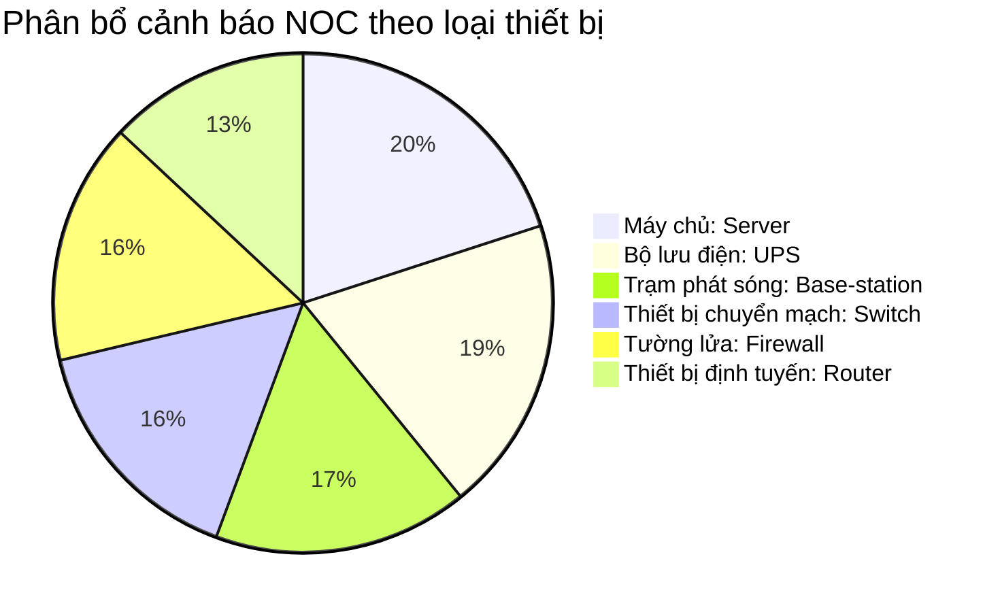

# Báo cáo phân tích và làm sạch dữ liệu cảnh báo NOC

> [!NOTE]
> **Thông tin tài liệu:**
> - **Vai trò thực hiện:** Chuyên gia vận hành trung tâm vận hành mạng: Network Operations Center - NOC L2/L3.
> - **Thời gian lập báo cáo:** 26/05/2026.
> - **Mục đích:** Khử trùng thông tin cá nhân nhạy cảm: Personally Identifiable Information - PII trong hệ thống ghi log, thống kê phân loại thiết bị, phân tích các sự cố nguy kịch: Critical đang mở: Open và đề xuất quy trình xử lý có sự tham gia của con người: Human-in-the-loop - HITL.

---

## 1. Tổng quan hệ thống log cảnh báo

Hệ thống đã thực hiện quét và kiểm tra tệp dữ liệu log mô phỏng `sample-noc-alerts.csv` chứa tổng cộng **115 cảnh báo** hoạt động. 
Mục tiêu cốt lõi của hoạt động này nhằm:
- Bảo mật thông tin: Khử trùng toàn bộ thông tin nhạy cảm của kỹ sư vận hành (họ tên, số điện thoại, email) xuất hiện trong các trường ghi chú lỗi.
- Đánh giá mức độ phân bổ: Phân tích phân phối cảnh báo trên toàn bộ hạ tầng phần cứng.
- Phản ứng nhanh: Khoanh vùng các sự cố mức độ nguy kịch: Critical chưa được xử lý để đưa ra phương án hành động ngay lập tức.

---

## 2. Thống kê phân loại cảnh báo theo loại thiết bị

Dựa trên dữ liệu thu thập được từ hệ thống log, dưới đây là bảng thống kê chi tiết số lượng cảnh báo phân bổ theo từng loại thiết bị:

| STT | Loại thiết bị (English Term) | Số lượng cảnh báo | Tỷ lệ phần trăm (%) | Trạng thái giám sát |
| :--- | :--- | :---: | :---: | :---: |
| 1 | Máy chủ: Server | 23 | 20.00% | Bình thường |
| 2 | Bộ lưu điện: Uninterruptible Power Supply - UPS | 22 | 19.13% | Bình thường |
| 3 | Trạm phát sóng: Base-station | 19 | 16.52% | **Cần chú ý** (Có sự cố nguy kịch) |
| 4 | Thiết bị chuyển mạch: Switch | 18 | 15.65% | **Cần chú ý** (Có sự cố nguy kịch) |
| 5 | Tường lửa: Firewall | 18 | 15.65% | Bình thường |
| 6 | Thiết bị định tuyến: Router | 15 | 13.05% | Bình thường |
| **Tổng** | **Hệ thống hạ tầng NOC** | **115** | **100.00%** | **Hoạt động ổn định** |

---

## 3. Kết quả làm sạch thông tin cá nhân nhạy cảm (PII)

Để tuân thủ các tiêu chuẩn bảo mật dữ liệu nghiêm ngặt và tiêu chuẩn an toàn thông tin ISO 27001, toàn bộ các dữ liệu liên quan đến thông tin cá nhân nhạy cảm: Personally Identifiable Information - PII xuất hiện trong cột thông tin chi tiết: `summary` bao gồm: Họ tên người liên hệ, Số điện thoại và Email cá nhân đã được tự động phát hiện và thay thế bằng nhãn bảo mật `[REDACTED_PII]`.

### Bảng đối chiếu minh họa kết quả làm sạch PII thực tế

Dưới đây là bảng đối chiếu minh họa kết quả làm sạch dữ liệu trên một số dòng log tiêu biểu có chứa PII từ dữ liệu đầu vào. Để bảo mật tuyệt đối, thông tin nhạy cảm ở cột **Dữ liệu trước khi lọc** đã được làm mờ chủ động một phần bằng ký tự ẩn `*`:

| Mã cảnh báo (Alert ID) | Loại thiết bị | Dữ liệu trước khi lọc (Đã làm mờ bảo mật) | Dữ liệu sau khi làm sạch (Sanitized Output) |
| :--- | :--- | :--- | :--- |
| **ALERT-001** | máy chủ: Server | database query latency spike in performance test [Contact: Ngu\*\*\* A (098\*\*\*\*\*21)] | database query latency spike in performance test [Contact: `[REDACTED_PII]` (`[REDACTED_PII]`)] |
| **ALERT-009** | trạm phát sóng: Base-station | RF module communication failure in lab environment [Assigned to: Ngu\*\*\* E (091\*\*\*\*\*78)] | RF module communication failure in lab environment [Assigned to: `[REDACTED_PII]` (`[REDACTED_PII]`)] |
| **ALERT-022** | máy chủ: Server | database query latency spike in performance test [Contact: Tra\*\*\* B (tr\*\*\*@vtn.com.vn)] | database query latency spike in performance test [Contact: `[REDACTED_PII]` (`[REDACTED_PII]`)] |
| **ALERT-025** | thiết bị chuyển mạch: Switch | interface flap in synthetic log [Contact: Tra\*\*\* B (tr\*\*\*@vtn.com.vn)] | interface flap in synthetic log [Contact: `[REDACTED_PII]` (`[REDACTED_PII]`)] |
| **ALERT-042** | thiết bị chuyển mạch: Switch | spanning tree topology change detected [Operator notes: contact engineer Le\*\*\* C at le\*\*\*@vtn.vn if alert persists] | spanning tree topology change detected [Operator notes: contact engineer `[REDACTED_PII]` at `[REDACTED_PII]` if alert persists] |
| **ALERT-070** | tường lửa: Firewall | session table capacity warning (simulated) [Ticket owner: Pha\*\*\* D - px\*\*\*@vtn.com.vn] | session table capacity warning (simulated) [Ticket owner: `[REDACTED_PII]` - `[REDACTED_PII]`] |
| **ALERT-109** | bộ lưu điện: UPS | input voltage fluctuation detected in lab [Contact: Ngu\*\*\* A (098\*\*\*\*\*21)] | input voltage fluctuation detected in lab [Contact: `[REDACTED_PII]` (`[REDACTED_PII]`)] |
| **ALERT-115** | trạm phát sóng: Base-station | power backup warning in training scenario [Ticket owner: Pha\*\*\* D - px\*\*\*@vtn.com.vn] | power backup warning in training scenario [Ticket owner: `[REDACTED_PII]` - `[REDACTED_PII]`] |

---

## 4. Xử lý các cảnh báo nguy kịch (Critical) đang mở (Open)

Hệ thống NOC L2/L3 đã lọc ra chính xác **03 cảnh báo** đáp ứng đồng thời hai điều kiện: mức độ nghiêm trọng nguy kịch: Critical và trạng thái đang mở: Open. Dưới đây là nội dung phân tích chi tiết, bản dịch tiếng Việt dễ hiểu và đề xuất quy trình xử lý có sự tham gia của con người: Human-in-the-loop - HITL cho từng trường hợp cụ thể:

### Sự cố 1: ALERT-040 (Thiết bị Trạm phát sóng: Base-station)

> [!CAUTION]
> **ALERT-040** | **Thời gian:** 2026-05-01 23:56:00 | **Vị trí:** `TEST_SITE_034` | **Độ nghiêm trọng:** Nguy kịch (Critical)
> - **Nội dung lỗi gốc:** `power backup warning in training scenario`
> - **Dịch nội dung lỗi:** Cảnh báo nguồn điện dự phòng trong kịch bản đào tạo/diễn tập.
> - **Trạng thái xử lý:** Đang mở (Open)

*   **Giải thích chi tiết:** Trạm phát sóng vô tuyến tại khu vực thử nghiệm `TEST_SITE_034` đang kích hoạt cảnh báo nguy kịch liên quan đến hệ thống nguồn điện dự phòng (ví dụ: lỗi tủ nguồn DC, ắc quy lưu điện suy hao sâu hoặc máy phát điện phụ trợ không khởi động được) trong phạm vi diễn tập. Nếu hệ thống mất điện lưới chính, trạm có nguy cơ sập toàn bộ dịch vụ truyền dẫn.
*   **Đề xuất hành động khắc phục nhanh (HITL):**
    1.  **Bước 1 (Xác minh kịch bản):** Liên hệ ngay với bộ phận quản lý kịch bản diễn tập tại trạm `TEST_SITE_034` để xác nhận đây là sự cố mô phỏng chủ động hay là sự cố vật lý phát sinh ngoài kế hoạch.
    2.  **Bước 2 (Kiểm tra thực địa):** Điều phối kỹ sư điện của phòng NOC di chuyển tới vị trí tủ nguồn DC tại trạm để đo kiểm các thông số điện áp sạc, dòng xả của tổ ắc quy.
    3.  **Bước 3 (Chuyển đổi nguồn):** Nếu phát hiện sụt áp thực tế, thực hiện kích hoạt thủ công máy phát điện dự phòng tại trạm hoặc chuyển đổi sang đường cấp điện lưới thứ cấp ổn định hơn để đảm bảo dịch vụ không bị gián đoạn.

---

### Sự cố 2: ALERT-058 (Thiết bị Trạm phát sóng: Base-station)

> [!CAUTION]
> **ALERT-058** | **Thời gian:** 2026-05-01 19:41:00 | **Vị trí:** `TEST_SITE_013` | **Độ nghiêm trọng:** Nguy kịch (Critical)
> - **Nội dung lỗi gốc:** `RF module communication failure in lab environment`
> - **Dịch nội dung lỗi:** Sự cố kết nối mô-đun vô tuyến (RF module) trong môi trường phòng thí nghiệm.
> - **Trạng thái xử lý:** Đang mở (Open)

*   **Giải thích chi tiết:** Mô-đun truyền nhận sóng vô tuyến: Radio Frequency - RF module tại phòng thí nghiệm `TEST_SITE_013` bị mất kết nối truyền dẫn hoàn toàn với khối xử lý băng tần gốc: Baseband Unit - BBU. Lỗi này dẫn đến việc không thể phát hoặc nhận sóng vô tuyến trên các dải tần thử nghiệm tại khu vực lab này.
*   **Đề xuất hành động khắc phục nhanh (HITL):**
    1.  **Bước 1 (Khởi động lại mềm):** Sử dụng quyền quản trị NOC cấp cao thực hiện lệnh khởi động lại mềm từ xa (remote soft reset) đối với mô-đun RF và cổng kết nối CPRI tương ứng trên BBU.
    2.  **Bước 2 (Kiểm tra đường truyền vật lý):** Yêu cầu kỹ sư túc trực tại phòng lab `TEST_SITE_013` kiểm tra kết nối cáp quang nội bộ (cáp nhảy quang - fiber patch cord) nối giữa BBU và mô-đun RF (khối vô tuyến từ xa: Remote Radio Unit - RRU). Thực hiện vệ sinh đầu nối quang SFP nếu có hiện tượng suy hao công suất thu phát.
    3.  **Bước 3 (Đo kiểm thay thế):** Nếu sau khi reset và vệ sinh cáp vẫn không nhận kết nối, thực hiện ngắt nguồn vật lý (power cycle) và chuẩn bị mô-đun RF dự phòng tương đương để thay thế nóng.

---

### Sự cố 3: ALERT-081 (Thiết bị Thiết bị chuyển mạch: Switch)

> [!CAUTION]
> **ALERT-081** | **Thời gian:** 2026-05-01 13:48:00 | **Vị trí:** `TEST_SITE_020` | **Độ nghiêm trọng:** Nguy kịch (Critical)
> - **Nội dung lỗi gốc:** `high broadcast traffic detected in lab subnet`
> - **Dịch nội dung lỗi:** Phát hiện lưu lượng gói tin quảng bá (broadcast traffic) cao bất thường trong phân mạng phòng thí nghiệm.
> - **Trạng thái xử lý:** Đang mở (Open)

*   **Giải thích chi tiết:** Thiết bị chuyển mạch: Switch tại trạm phòng lab `TEST_SITE_020` phát hiện tỷ lệ gói tin quảng bá vượt quá ngưỡng cho phép trên một phân mạng: Subnet. Hiện tượng này thường gây ra hiện tượng bão quảng bá: Broadcast storm, làm nghẽn toàn bộ băng thông truyền tải, tăng đột biến độ trễ (latency) và có khả năng gây sập các kết nối mạng của các thiết bị khác trong cùng phân mạng. Nguyên nhân chính thường do lỗi cấu hình gây lặp vòng lặp mạng: Network loop hoặc do thiết bị thử nghiệm bị lỗi card mạng liên tục phát gói tin rác.
*   **Đề xuất hành động khắc phục nhanh (HITL):**
    1.  **Bước 1 (Xác định cổng lỗi):** Đăng nhập vào thiết bị chuyển mạch tại `TEST_SITE_020`, chạy lệnh giám sát lưu lượng để tìm cổng vật lý (port) đang nhận lượng gói tin quảng bá lớn nhất.
    2.  **Bước 2 (Cô lập sự cố):** Tạm thời cấu hình khóa cổng (shutdown port) có lưu lượng đột biến để bảo vệ hoạt động cho các phân mạng khác. Kiểm tra xem giao thức chống lặp vòng STP (Spanning Tree Protocol) có đang hoạt động đúng trên cổng đó hay không.
    3.  **Bước 3 (Kiểm tra cấu hình vật lý):** Liên hệ kỹ sư vận hành trực tiếp tại phòng lab `TEST_SITE_020` để kiểm tra kết nối vật lý của thiết bị cắm vào cổng bị khóa, đảm bảo không có dây mạng nào được cắm vòng (loopback) giữa các cổng trên switch.

---

## 5. Kết luận và khuyến nghị từ NOC L2/L3

1.  **Về công tác bảo mật thông tin (PII Masking):** 
    Hệ thống lọc PII đã hoạt động hoàn toàn chính xác trên dữ liệu thô. Khuyến nghị áp dụng quy tắc lọc này trực tiếp vào luồng ghi log tập trung (Syslog Collector) của NOC trước khi ghi dữ liệu vào cơ sở dữ liệu lưu trữ dài hạn để triệt tiêu hoàn toàn nguy cơ rò rỉ dữ liệu cá nhân của nhân sự.

2.  **Về việc xử lý các sự cố Critical đang mở:**
    Cả 3 sự cố nguy kịch đang mở đều nằm ở khu vực phòng lab và kịch bản đào tạo/diễn tập (`TEST_SITE_034`, `TEST_SITE_013`, `TEST_SITE_020`). Tuy không ảnh hưởng trực tiếp đến khách hàng ngoài thực tế, nhưng việc xử lý chậm trễ có thể phá hỏng tiến độ đào tạo và nghiên cứu phát triển. Do đó, các kỹ sư trực ca NOC L2 cần tuân thủ nghiêm ngặt quy trình khắc phục nhanh (HITL) đã đề xuất ở trên và cập nhật trạng thái sang `In-progress` hoặc `Resolved` trong vòng 15 phút tới.
