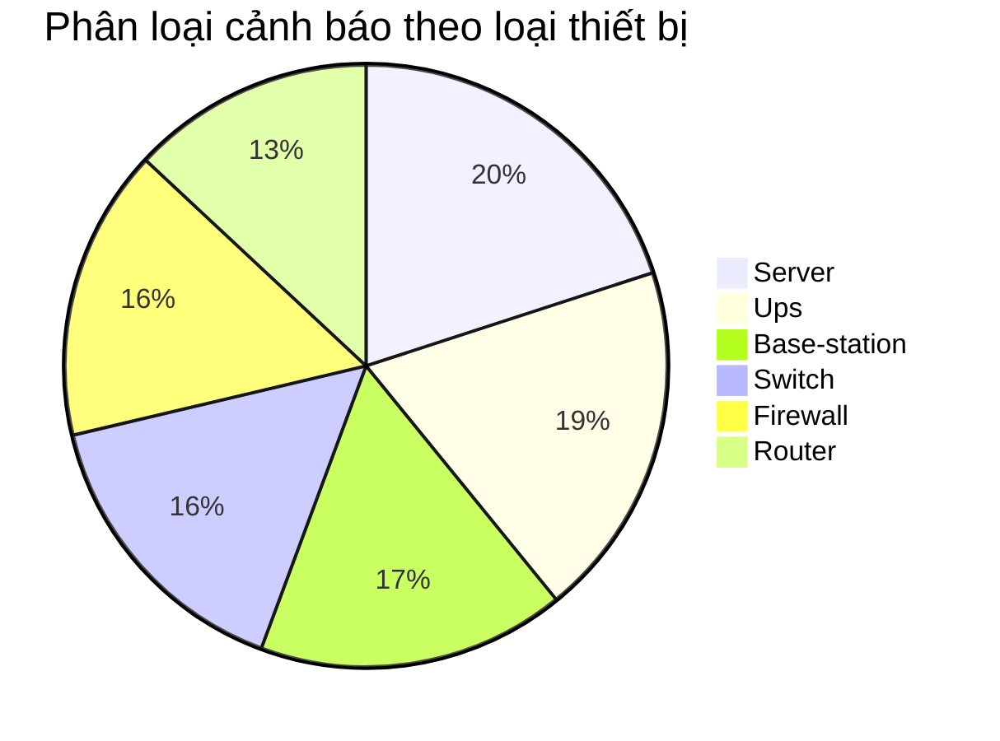

# Báo cáo phân tích và làm sạch log NOC tuần tự động

Báo cáo này được tự động tạo bởi Checkpoint A nhằm tái hiện và kiểm tra kết quả thị phạm phân tích dữ liệu log NOC.

## 1. Kết quả làm sạch thông tin định danh cá nhân (PII)
Toàn bộ thông tin cá nhân của các kỹ sư trực ca (Họ tên, Số điện thoại, Email) xuất hiện trong cột chi tiết log thô đã được phát hiện và che giấu bằng nhãn `[REDACTED_PII]` để đảm bảo an toàn thông tin dữ liệu.

## 2. Thống kê số lượng cảnh báo theo loại thiết bị (Device Type)

| Loại thiết bị (Device Type) | Số lượng cảnh báo |
| --- | ---: |
| Server | 23 |
| Ups | 22 |
| Base-station | 19 |
| Switch | 18 |
| Firewall | 18 |
| Router | 15 |

### Biểu đồ phân loại trực quan (Mermaid Pie Chart)

## 3. Danh sách cảnh báo nguy kịch (Critical) đang mở (Open) & Quy trình ứng cứu (HITL)

Dưới đây là 3 cảnh báo nguy kịch đang mở cần được ưu tiên xử lý lập tức kèm quy trình ứng cứu nhanh có con người tham gia kiểm duyệt (Human-in-the-loop):

#### ALERT-040 - Trạm TEST_SITE_034 (Base-station)
- **Thời gian xảy ra:** `2026-05-01 23:56:00`
- **Mô tả lỗi gốc:** *power backup warning in training scenario*
- **Dịch tiếng Việt:** **Cảnh báo nguồn dự phòng trong kịch bản đào tạo**
- **Quy trình ứng cứu nhanh (HITL):** Kỹ sư trực NOC L2 liên hệ khẩn cấp với đội kỹ thuật tại trạm TEST_SITE_034 để kiểm tra trạng thái hoạt động của máy phát điện hoặc ắc quy dự phòng tại chỗ.

#### ALERT-058 - Trạm TEST_SITE_013 (Base-station)
- **Thời gian xảy ra:** `2026-05-01 19:41:00`
- **Mô tả lỗi gốc:** *RF module communication failure in lab environment*
- **Dịch tiếng Việt:** **Lỗi kết nối mô-đun RF trong môi trường phòng lab**
- **Quy trình ứng cứu nhanh (HITL):** Kỹ sư NOC L2 thực hiện kiểm tra ping/kết nối quang đến mô-đun RF của trạm TEST_SITE_013. Nếu không phục hồi, điều phối kỹ thuật viên onsite L3 đến phòng lab để thay thế nóng mô-đun lỗi.

#### ALERT-081 - Trạm TEST_SITE_020 (Switch)
- **Thời gian xảy ra:** `2026-05-01 13:48:00`
- **Mô tả lỗi gốc:** *high broadcast traffic detected in lab subnet*
- **Dịch tiếng Việt:** **Phát hiện lưu lượng quảng bá (broadcast traffic) vượt ngưỡng nguy kịch trong mạng con phòng lab**
- **Quy trình ứng cứu nhanh (HITL):** Kỹ sư NOC L2 truy cập Switch tại TEST_SITE_020, xác định cổng (port) phát sinh lưu lượng lớn, thực hiện giới hạn băng thông quảng bá (storm control) hoặc cô lập VLAN bị ảnh hưởng tạm thời để tránh nghẽn toàn hệ thống mạng.