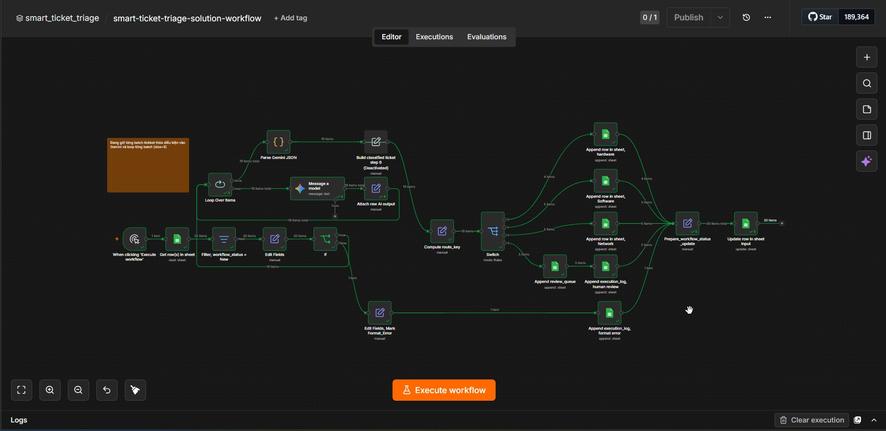
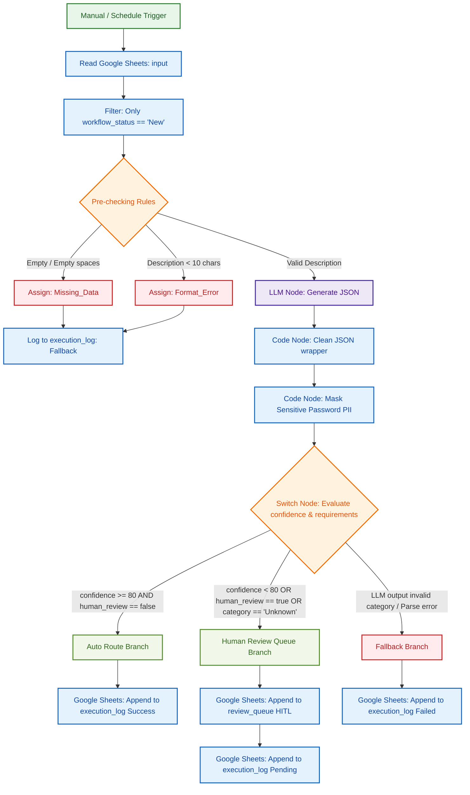

# Kiến trúc quy trình làm việc AI phân loại sự cố thông minh hoàn chỉnh

Tài liệu này mô tả chi tiết sơ đồ kiến trúc luồng dữ liệu đầu-cuối (kiến trúc đầu-cuối: end-to-end architecture) của hệ thống tự động hóa xử lý yêu cầu sự cố công nghệ thông tin sử dụng trí tuệ nhân tạo. Học viên sử dụng sơ đồ này làm đích đến để đối chiếu và lắp ghép các cấu phần trên công cụ tự động hóa quy trình: n8n.

> [!TIP]
> **ĐÁP ÁN BÀI LAB:** Ban tổ chức cung cấp sẵn tệp cấu trúc quy trình hoàn chỉnh (đáp án quy trình n8n) tại liên kết tương đối: [smart-ticket-triage-solution-workflow.json](smart-ticket-triage-solution-workflow.json). Giảng viên sử dụng tệp này để đối chiếu kết quả, hoặc học viên có thể dùng để nhập trực tiếp (import) vào n8n của mình nhằm tự kiểm chứng sau buổi học.

---

## 1. Sơ đồ quy trình thực tế trên n8n: n8n Workflow Screenshot

Dưới đây là hình ảnh chụp màn hình giao diện cấu trúc quy trình thực tế được thiết lập và kiểm thử thành công trên n8n của chuyên gia:

---

## 2. Sơ đồ luồng xử lý dữ liệu logic: Mermaid Flowchart

Dưới đây là sơ đồ luồng tổng thể từ khâu tiếp nhận dữ liệu, tiền kiểm tra lọc lỗi cục bộ, gọi mô hình trí tuệ nhân tạo (LLM), lọc dữ liệu nhạy cảm, rẽ nhánh điều kiện và kết thúc ở các cổng đầu ra tương ứng:

---

## 2. Đặc tả các cổng rẽ nhánh đầu ra: Branching specifications

Quy trình sử dụng một nút rẽ nhánh điều kiện (nút rẽ nhánh điều kiện: Switch node) để phân phối dữ liệu dựa trên kết quả đầu ra của mô hình AI:

### A. Nhánh tự động định tuyến (Auto Route Branch)
* **Điều kiện kích hoạt:** 
  $$\text{ai\_confidence} \ge 80 \quad \text{AND} \quad \text{human\_review\_required} == \text{false}$$
* **Hành động hệ thống:** Định tuyến tự động phiếu sự cố đến các hàng chờ chuyên môn tương ứng (Hardware, Software, Network) và gửi thông báo tự động.
* **Mẫu ghi log:** Ghi nhận cột `branch_taken` là `Auto_Route` và trạng thái `final_status` là `Success`.

### B. Nhánh con người duyệt (Human Review Queue Branch)
* **Điều kiện kích hoạt:** 
  $$\text{ai\_confidence} < 80 \quad \text{OR} \quad \text{human\_review\_required} == \text{true} \quad \text{OR} \quad \text{ai\_category} == \text{"Unknown"}$$
* **Hành động hệ thống:** Tạm dừng quy trình tự động, chuyển yêu cầu sự cố sang trang bảng tính duyệt thủ công `review_queue` cho nhân viên kỹ thuật xử lý thủ công.
* **Mẫu ghi log:** Ghi nhận cột `branch_taken` là `Human_Review` và trạng thái `final_status` là `Pending_Human_Review`.

### C. Nhánh xử lý lỗi dự phòng (Fallback Branch)
* **Điều kiện kích hoạt:** Khi xảy ra lỗi phân tích cú pháp JSON ở bước trước, AI trả về kết quả lỗi định dạng, hoặc phân loại nằm ngoài 3 nhóm quy định.
* **Hành động hệ thống:** Báo động lỗi hệ thống, dừng an toàn yêu cầu sự cố và gán nhãn xử lý khẩn cấp.
* **Mẫu ghi log:** Ghi nhận cột `branch_taken` là `Fallback`, lưu mã lỗi tương ứng (ví dụ: `JSON_PARSE_ERROR`) và gán trạng thái `final_status` là `Failed`.
