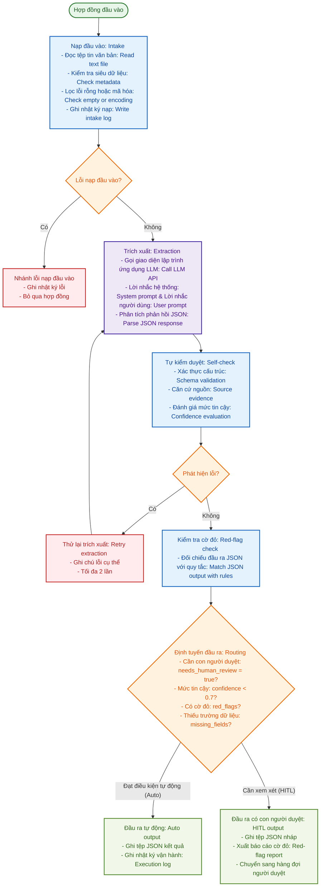
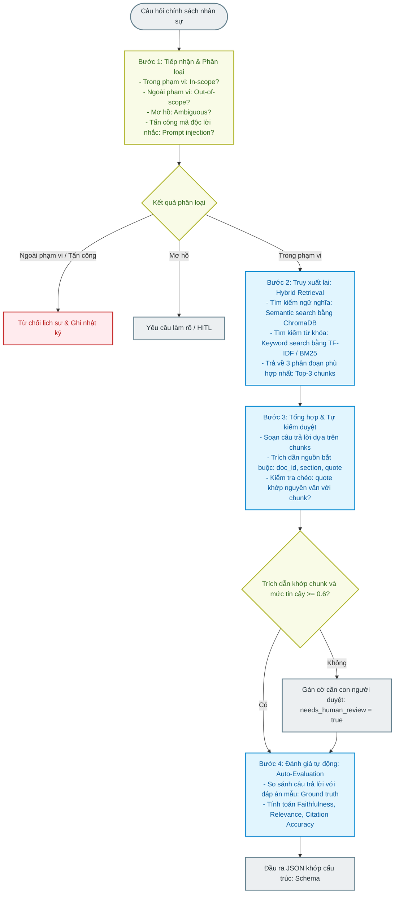

# Sơ đồ thực hành ngày 02

Tài liệu này tổng hợp các sơ đồ kiến trúc tác nhân trí tuệ nhân tạo (tiếng Việt: AI agent) và quy trình xử lý dữ liệu cho các bài thực hành thuộc ngày 02 (tiếng Việt: Day 02). Các sơ đồ được biểu diễn bằng mã Mermaid giúp hiển thị trực quan trong giao diện của môi trường phát triển tích hợp (tiếng Việt: Integrated Development Environment - IDE).

---

## 1. Sơ đồ kiến trúc tác nhân AI trích xuất điều khoản hợp đồng: Expected Agent Architecture

Dưới đây là sơ đồ kiến trúc chi tiết của tác nhân trích xuất điều khoản hợp đồng (tiếng Việt: Contract Term Extractor) thuộc buổi học số 03 (tiếng Việt: Session 03):



---

## 2. Bản đồ khái niệm luồng xử lý tổng thể: Concept Map

Sơ đồ tuần tự các bước xử lý từ tài liệu thô cho tới đầu ra cuối cùng:

```mermaid
graph TD
    classDef stepNode fill:#F5F5F5,stroke:#9E9E9E,stroke-width:2px,color:#212121;
    classDef decisionNode fill:#FFF8E1,stroke:#FFB300,stroke-width:2px,color:#FF8F00;
    classDef routeNode fill:#E0F2F1,stroke:#00897B,stroke-width:2px,color:#004D40;
    classDef errorNode fill:#FFEBEE,stroke:#C62828,stroke-width:2px,color:#B71C1C;

    Doc([Hợp đồng đầu vào]) --> Step1[Bước 1: Kiểm tra đầu vào<br>- Tệp tin rỗng?<br>- Nhận dạng ký tự quang học lỗi: OCR error?<br>- Thiếu siêu dữ liệu: Missing metadata?]:::stepNode
    Step1 --> Dec1{Hợp lệ?}:::decisionNode
    Dec1 -- "Không" --> Err1[Ghi nhật ký: Log + Con người duyệt: HITL]:::errorNode
    Dec1 -- "Có" --> Step2[Bước 2: Trích xuất điều khoản<br>- Lời nhắc hệ thống & người dùng → JSON<br>- Bắt buộc có căn cứ nguồn: Source evidence]:::stepNode
    
    Step2 --> Step3[Bước 3: Tự kiểm: Self-check<br>- Đủ trường dữ liệu? Đúng định dạng?<br>- Căn cứ nguồn khớp với phân đoạn văn bản: Chunk]:::stepNode
    Step3 --> Dec2{Thông qua?}:::decisionNode
    Dec2 -- "Không" --> Step2
    Dec2 -- "Có" --> Step4[Bước 4: Đối chiếu kho điều khoản<br>- Thư viện điều khoản: Clause library<br>- Quy tắc phát hiện cờ đỏ: Red-flag rules]:::stepNode
    
    Step4 --> Dec3{Có cờ đỏ?}:::decisionNode
    Dec3 -- "Có" --> Flag[Thêm vào danh sách cờ đỏ: red_flags[]]:::routeNode
    Dec3 -- "Không" --> Step5[Bước 5: Xuất kết quả<br>- Sinh tệp JSON & nhật ký vận hành: Execution log]:::stepNode
    Flag --> Step5
    
    Step5 --> Dec4{Cần người duyệt?}:::decisionNode
    Dec4 -- "needs_human_review = false" --> Done([Hoàn thành: DONE]):::routeNode
    Dec4 -- "needs_human_review = true" --> Queue([Hàng đợi người duyệt: HITL]):::routeNode

    class Doc stepNode;
    class Step1,Step2,Step3,Step4,Step5 stepNode;
    class Dec1,Dec2,Dec3,Dec4 decisionNode;
    class Err1 errorNode;
    class Flag,Done,Queue routeNode;
```

---

## 3. Luồng thực thi kỹ năng RAG chính sách nhân sự: HR Policy QA RAG Workflow

Kiến trúc luồng xử lý RAG chủ động (tiếng Việt: Agentic RAG) kết hợp tìm kiếm ngữ nghĩa và từ khóa ở buổi học số 04 (tiếng Việt: Session 04):


