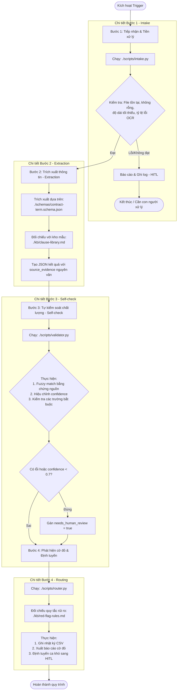

# Sơ đồ quy trình thực thi (Execution Workflow Diagram)

Dưới đây là sơ đồ Mermaid thể hiện quy trình 4 bước của Agent Skill được định nghĩa trong [SKILL.md](file:///c:/Users/DELL/Documents/4.%20Presentations%20&%20Training/VTN/vtn-student-kit/03-practices/day-02/session-03-ai-agent-design/outputs/contract-term-extractor/SKILL.md).

