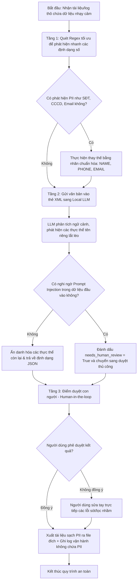

# Bản đặc tả luồng công việc logic (Logical Workflow Blueprint)

*   **Tên dự án ứng dụng:** [Ví dụ: Ứng dụng trợ lý AI ẩn danh dữ liệu nhân sự tự động]
*   **Tên nhóm thực hiện:** [Điền tên nhóm]
*   **Đơn vị áp dụng:** [Ví dụ: Trung tâm Vận hành khai thác mạng / Phòng Hạ tầng Viettel Net]

---

## 1. Sơ đồ khối quy trình (Logical Flowchart)
*Học viên vẽ sơ đồ luồng công việc logic bằng PowerPoint hoặc sơ đồ khối đơn giản và chèn hình ảnh vào đây. Dưới đây là mô tả chi tiết của luồng.*

---

## 2. Mô tả chi tiết các bước trong luồng

### Bước 1: Tiếp nhận và Lọc thô (Tầng Regex)
*   **Đầu vào:** Văn bản hoặc log hệ thống chứa dữ liệu cần quét.
*   **Hành động:** Sử dụng các biểu thức chính quy (Regex) cục bộ để phát hiện nhanh và ẩn danh các trường thông tin có cấu trúc cố định (Ví dụ số điện thoại 10 chữ số, số CCCD 12 chữ số, email định dạng chuẩn).
*   **Mục tiêu:** Giảm tải cho mô hình ngôn ngữ lớn (LLM) bằng cách xử lý trước các định dạng rõ ràng, tăng tốc độ phản hồi.

### Bước 2: Xử lý thông minh bằng Local LLM (Tầng Trí tuệ nhân tạo)
*   **Đầu vào:** Văn bản sau khi lọc thô, được bọc trong thẻ XML `<user_data>...</user_data>`.
*   **Hành động:** Chuyển văn bản sang mô hình ngôn ngữ lớn cục bộ (`qwen3.5:1.5b-instruct` hoặc `gemma4:e2b` chạy offline qua Ollama) để nhận diện các thực thể dựa trên ngữ cảnh (ví dụ: tên người lắt léo trùng danh từ thường, địa chỉ phức tạp).
*   **Ranh giới an toàn:** Tự động phát hiện các từ khóa hoặc kịch bản tấn công thay đổi vai trò (Prompt Injection). Nếu phát hiện, đánh dấu cờ cảnh báo rủi ro cao.

### Bước 3: Kiểm duyệt và Fallback (Tầng Human-in-the-loop)
*   **Đầu vào:** Văn bản đã được ẩn danh hóa sơ bộ kèm theo cờ cảnh báo lỗi/bảo mật.
*   **Hành động:** 
    *   Người dùng vận hành (Human-in-the-loop) xem trước kết quả trên màn hình tương tác.
    *   *Kịch bản bình thường:* Xác nhận kết quả sạch PII và xuất file.
    *   *Kịch bản lỗi/thiếu dữ liệu (Fallback):* Người dùng tự tay điều chỉnh trực tiếp các từ bị ẩn sót hoặc ẩn nhầm trên màn hình trước khi lưu file chính thức.

### Bước 4: Lưu trữ và Ghi nhật ký (Tầng Output & Logging)
*   **Đầu ra:** Xuất file kết quả sạch 100% PII.
*   **Ghi log:** Hệ thống tự động ghi lại nhật ký thực thi (Thời gian, Kích thước file, Trạng thái thành công/Cảnh báo, Số lượng PII đã ẩn danh) vào file `execution-log.csv`. **Tuyệt đối không lưu lại dữ liệu gốc chưa ẩn danh vào log.**

---

## 3. Ranh giới Phân vai (Human-in-the-loop Boundaries)

Để đảm bảo hiệu quả vận hành tối ưu tại Viettel Net, ranh giới phân vai giữa Con người và AI được thiết lập như sau:

*   **AI làm:** Tự động phát hiện, gắn nhãn PII và đưa ra đề xuất văn bản ẩn danh sơ bộ trong vòng 2 giây. Phát hiện các kịch bản bất thường và đưa ra cảnh báo bảo mật.
*   **Con người làm (Chốt chặn cuối cùng):** Phê duyệt kết quả cuối cùng. Trực tiếp can thiệp sửa đổi các trường hợp AI xử lý sai (false positive/negative). Không hệ thống AI nào được phép tự động lưu hoặc gửi báo cáo ra bên ngoài mà không có sự xác nhận của con người.
