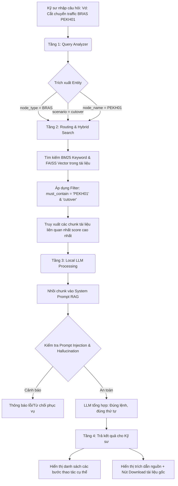

# Bản đặc tả luồng công việc logic (Logical Workflow Blueprint)

*   **Tên dự án ứng dụng:** NetSaveAI — Chatbot RAG cho Vận Hành Mạng Viễn Thông
*   **Tên nhóm thực hiện:** [Điền tên nhóm]
*   **Đơn vị áp dụng:** Trung tâm Vận hành khai thác mạng (NOC) / Viettel Net

---

## 1. Sơ đồ khối quy trình (Logical Flowchart)
*Dưới đây là sơ đồ luồng công việc logic mô tả cách hệ thống NetSaveAI xử lý câu hỏi của kỹ sư.*

---

## 2. Mô tả chi tiết các bước trong luồng

### Bước 1: Phân tích Truy vấn (Query Analyzer)
*   **Đầu vào:** Câu hỏi ngôn ngữ tự nhiên của kỹ sư trực ca (Tiếng Việt).
*   **Hành động:** Hệ thống sử dụng thuật toán NLP/Regex để nhận diện và bóc tách các thực thể quan trọng bao gồm: 
    *   Tên node mạng (Ví dụ: SGHL04, PEKH01).
    *   Loại thiết bị mạng (Ví dụ: GGSN, BRAS, vEPC).
    *   Loại kịch bản vận hành (Ví dụ: cô lập dịch vụ, cutover, xử lý sự cố).
*   **Mục tiêu:** Tạo bộ lọc thông minh giúp thu hẹp phạm vi tìm kiếm thay vì tìm mò trên toàn bộ hàng nghìn tài liệu.

### Bước 2: Tìm kiếm kết hợp (Routing & Hybrid Search)
*   **Đầu vào:** Các điều kiện lọc (Filters) từ Bước 1.
*   **Hành động:** 
    *   Chuyển hướng (Routing) đến đúng nhóm vector index (Profile tài liệu) của loại thiết bị đó.
    *   Thực hiện Hybrid Search kết hợp giữa tìm kiếm từ khóa (BM25 - tránh bỏ sót các tham số kỹ thuật viết tắt) và tìm kiếm ngữ nghĩa vector (FAISS - hiểu các từ đồng nghĩa như "isolation" và "cô lập").
    *   Lọc khắt khe (must_contain) để loại trừ các hàng trong file Excel của mạng 3G khi kỹ sư hỏi mạng 4G.

### Bước 3: Tổng hợp quy trình bằng Local LLM
*   **Đầu vào:** 3-5 đoạn tài liệu (chunks) có điểm số phù hợp nhất (score > threshold).
*   **Hành động:** Bơm các chunk này vào Context của System Prompt và gọi LLM nội bộ (qwen3.5/gemma4). LLM sẽ phân tích ngữ cảnh, sắp xếp lại các bước kỹ thuật, đảm bảo không thay đổi dòng lệnh (CLI).
*   **Ranh giới an toàn:** LLM được yêu cầu không "ảo giác" (hallucination), nếu chunk không có quy trình thì phải trả lời là không tìm thấy.

### Bước 4: Hiển thị và Bàn giao thực thi (Output & Execution)
*   **Đầu ra:** Câu trả lời rõ ràng trên Chat UI.
*   **Hành động:** Trình bày quy trình theo từng bước đánh số. Bắt buộc hiển thị rõ nguồn tài liệu, sheet và số hàng cụ thể. Cung cấp một nút "Tải xuống" để kỹ sư lấy file gốc về máy tính.

---

## 3. Ranh giới Phân vai (Human-in-the-loop Boundaries)

Để đảm bảo hiệu quả vận hành tối ưu tại Viettel Net và tránh downtime cho hàng triệu thuê bao, ranh giới phân vai được thiết lập như sau:

*   **AI (NetSaveAI) làm:** Tự động định vị, trích xuất và tổng hợp các bước kỹ thuật, dòng lệnh (CLI) từ hàng nghìn file tài liệu nội bộ trong thời gian dưới 30 giây.
*   **Con người (Kỹ sư NOC) làm (Chốt chặn cuối cùng):** Đọc, xác minh lại với file tài liệu gốc (thông qua link tải xuống). **Chỉ có kỹ sư mới là người được quyền copy lệnh và đưa vào hệ thống thiết bị mạng để thực thi (Cutover/Cô lập).** AI tuyệt đối KHÔNG được cấp quyền SSH trực tiếp vào thiết bị viễn thông để tự thực thi lệnh.
