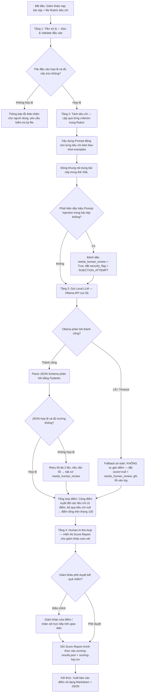

# Bản đặc tả luồng công việc logic (Logical Workflow Blueprint)

*   **Tên dự án ứng dụng:** AI Scoring Assistant — Chấm điểm tự động theo tiêu chí cho trước
*   **Tên nhóm thực hiện:** Nhóm 1
*   **Đơn vị áp dụng:** Trung tâm Đào tạo & Phát triển Năng lực số — Viettel Net

---

## 1. Sơ đồ khối quy trình (Logical Flowchart)

---

## 2. Mô tả chi tiết các bước trong luồng

### Bước 1: Tiền xử lý và Validate đầu vào (Tầng Input Validation)
*   **Đầu vào:** File bài nộp (`.txt` / `.md` / `.docx`) + File rubric tiêu chí (`.json` / `.yaml`).
*   **Hành động:**
    *   Kiểm tra file tồn tại, đúng định dạng, kích thước không vượt giới hạn an toàn (mặc định ≤ 50.000 ký tự).
    *   Parse rubric: kiểm tra mỗi tiêu chí có đủ các trường bắt buộc (`criterion_id`, `name`, `max_score`, `description`, `good_example`, `bad_example`).
*   **Mục tiêu:** Ngăn chặn lỗi downstream do dữ liệu đầu vào không hợp lệ.

### Bước 2: Xây dựng Prompt động theo từng tiêu chí (Tầng Prompt Engineering)
*   **Đầu vào:** Một tiêu chí từ Rubric + toàn bộ nội dung bài nộp.
*   **Hành động:**
    *   Tạo System Prompt cứng (hardcoded) định nghĩa vai trò giám khảo AI và quy tắc phòng thủ Prompt Injection.
    *   Xây dựng User Prompt động: nhúng mô tả tiêu chí, thang điểm, ví dụ few-shot, và nội dung bài nộp được đóng khung trong `<submission>...</submission>`.
*   **Ranh giới an toàn:** Mọi nội dung bài nộp là **dữ liệu cần đánh giá**, không bao giờ là lệnh điều khiển.

### Bước 3: Gọi Local LLM và Parse kết quả (Tầng AI Inference)
*   **Đầu vào:** Prompt đã xây dựng.
*   **Hành động:** Gọi Ollama API (`http://localhost:11434`) với timeout 30 giây. Parse phản hồi JSON bằng Pydantic Schema với 8 trường cố định (xem chi tiết tại tài liệu Core Prompt Design).
*   **Cơ chế Retry:** Tự động thử lại tối đa 2 lần khi nhận được JSON không hợp lệ.
*   **Fallback an toàn:** Khi mất kết nối Ollama hoặc hết retry → đặt `score = null` (KHÔNG gán điểm tự động), bật cờ `needs_human_review` để giám khảo chấm thủ công, tránh phát sinh điểm sai.

### Bước 4: Kiểm duyệt của con người (Tầng Human-in-the-loop)
*   **Đầu vào:** Score Report sơ bộ gồm điểm từng tiêu chí + nhận xét + trích dẫn bằng chứng.
*   **Hành động:**
    *   Hiển thị bảng điểm tương tác trên CLI, highlight các tiêu chí có cờ `needs_human_review`.
    *   *Kịch bản bình thường:* Giám khảo xác nhận → lưu kết quả chính thức.
    *   *Kịch bản Fallback:* Giám khảo nhập điểm và nhận xét tay cho các tiêu chí bị lỗi trước khi lưu.
*   **Ràng buộc quan trọng:** **Không có điểm số nào được ghi vào hồ sơ chính thức nếu chưa có xác nhận của giám khảo.**

### Bước 5: Lưu trữ và Xuất báo cáo (Tầng Output & Logging)
*   **Đầu ra chính:** `scoring-results.json` (chi tiết) + bản tóm tắt `score-report-[id].md` (dành cho ứng viên).
*   **Ghi log:** `scoring-log.csv` lưu 7 trường metadata: `run_id`, `submission_id`, `rubric_id`, `total_score`, `status`, `needs_human_review`, `created_at`. **Tuyệt đối không lưu nội dung bài nộp thô vào log.**

---

## 3. Ranh giới Phân vai (Human-in-the-loop Boundaries)

*   **AI làm:** Tự động đọc bài, đối chiếu từng tiêu chí, đề xuất điểm số kèm trích dẫn bằng chứng trong vòng 10–30 giây/bài. Phát hiện bất thường (prompt injection, bài nộp trống, rubric thiếu trường).
*   **Con người làm (Chốt chặn cuối cùng):** Phê duyệt hoặc điều chỉnh điểm số và nhận xét trước khi ghi chính thức. Xử lý mọi trường hợp AI gán cờ `needs_human_review`. Không có điểm số nào được xuất ra ngoài mà không có chữ ký xác nhận của giám khảo.
