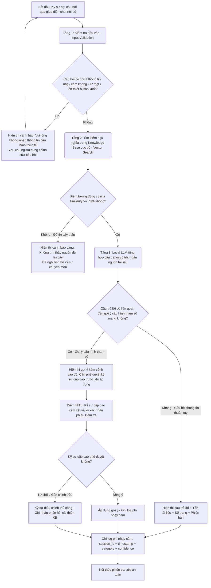

# Bản đặc tả luồng công việc logic (Logical Workflow Blueprint)

*   **Tên dự án ứng dụng:** AI Agent Tra Cứu Tài Liệu Kỹ Thuật Mạng Lưới Viettel (Network Doc Assistant)
*   **Tên nhóm thực hiện:** [Tên nhóm thực hành — mô phỏng]
*   **Đơn vị áp dụng:** Trung tâm Vận hành Khai thác Mạng / Phòng Quy hoạch Mạng lưới Viettel Net

---

## 1. Sơ đồ khối quy trình (Logical Flowchart)

---

## 2. Mô tả chi tiết các bước trong luồng

### Bước 1: Tiếp nhận và Kiểm tra đầu vào (Input Validation Layer)
*   **Đầu vào:** Câu hỏi bằng tiếng Việt tự nhiên từ kỹ sư qua giao diện chat nội bộ.
*   **Hành động:** Quét câu hỏi bằng bộ lọc Regex để phát hiện các thông tin nhạy cảm không nên nhập vào hệ thống: địa chỉ IP thực tế (`\d{1,3}\.\d{1,3}\.\d{1,3}\.\d{1,3}`), tên hostname thiết bị sản xuất, thông tin cấu hình đang chạy.
*   **Mục tiêu:** Ngăn người dùng vô tình tiết lộ thông tin cấu hình mạng thực tế vào hệ thống log.
*   **Đầu ra:** Câu hỏi sạch được chuyển sang tầng tìm kiếm; hoặc cảnh báo yêu cầu chỉnh sửa.

### Bước 2: Tìm kiếm ngữ nghĩa trong Knowledge Base cục bộ (Vector Search / RAG)
*   **Đầu vào:** Câu hỏi đã qua kiểm tra đầu vào.
*   **Hành động:** Mã hóa câu hỏi thành vector (embedding) và so sánh với các vector của đoạn tài liệu trong VectorDB cục bộ. Truy xuất Top-K đoạn tài liệu liên quan nhất kèm điểm tương đồng (cosine similarity score).
*   **Ranh giới an toàn:** Nếu điểm tương đồng < 70%, hệ thống KHÔNG tự bịa đặt câu trả lời mà hiển thị cảnh báo "Không tìm thấy nguồn đủ tin cậy".
*   **Đầu ra:** Danh sách đoạn tài liệu liên quan + điểm tin cậy + metadata (tên tài liệu, phiên bản, số trang).

### Bước 3: Tổng hợp câu trả lời bằng Local LLM (AI Synthesis Layer)
*   **Đầu vào:** Câu hỏi + các đoạn tài liệu liên quan đã tìm kiếm được, được bọc trong cấu trúc prompt an toàn.
*   **Hành động:** Mô hình ngôn ngữ lớn **cục bộ** (chạy qua Ollama, **không kết nối Internet**) tổng hợp câu trả lời ngắn gọn, súc tích và bắt buộc trích dẫn tên tài liệu nguồn, số trang, phiên bản.
*   **Ranh giới an toàn:** Mọi câu trả lời liên quan đến gợi ý cấu hình tham số mạng đều phải kích hoạt HITL — hiển thị cảnh báo bắt buộc phê duyệt kỹ sư cấp cao.
*   **Đầu ra:** Câu trả lời có cấu trúc + trích dẫn nguồn + cờ HITL (nếu cần).

### Bước 4: Kiểm duyệt con người và Phê duyệt (HITL Gate)
*   **Đầu vào:** Câu trả lời của AI kèm cờ HITL (với gợi ý cấu hình) hoặc cảnh báo tin cậy thấp.
*   **Hành động:**
    *   *Với câu hỏi thông tin thuần túy:* Kỹ sư đọc kết quả, có thể báo cáo "Thông tin có thể lỗi thời" để kích hoạt rà soát KB.
    *   *Với gợi ý cấu hình tham số:* Kỹ sư cấp cao **bắt buộc** xem xét, ký xác nhận phiếu kiểm tra trước khi áp dụng vào thiết bị thực. AI chỉ là công cụ gợi ý — **không tự thực thi cấu hình**.
*   **Đầu ra:** Quyết định phê duyệt / từ chối / chỉnh sửa; log phiên được ghi lại phi nhạy cảm.

### Bước 5: Ghi nhật ký phi nhạy cảm (Sanitized Logging)
*   **Đầu ra:** File log ghi nhận: `session_id`, `timestamp`, `category` (loại câu hỏi), `confidence_score`, `hitl_required`, `action_taken`.
*   **Tuyệt đối KHÔNG ghi:** Nội dung câu hỏi đầy đủ, nội dung câu trả lời, địa chỉ IP, tên thiết bị thật.

---

## 3. Ranh giới Phân vai (Human-in-the-loop Boundaries)

Để đảm bảo an toàn và hiệu quả vận hành tại Viettel Net, ranh giới phân vai giữa Con người và AI được thiết lập như sau:

*   **AI làm:** Tự động tìm kiếm trong Knowledge Base, tổng hợp câu trả lời có trích dẫn nguồn trong vòng dưới 2 phút. Đưa ra cảnh báo khi độ tin cậy thấp hoặc khi phát hiện câu hỏi về cấu hình tham số cần kiểm duyệt.
*   **Con người làm (Chốt chặn cuối cùng):**
    *   Kỹ sư chuyên môn cao phê duyệt mọi gợi ý cấu hình tham số trước khi áp dụng.
    *   Kỹ sư định kỳ rà soát, cập nhật tài liệu trong Knowledge Base (ít nhất hàng quý).
    *   Người quản lý KB phê duyệt mọi tài liệu trước khi đưa vào hệ thống.
    *   **Không có chức năng nào cho phép AI tự động áp dụng cấu hình mạng thực tế** mà không có sự xác nhận của con người.
