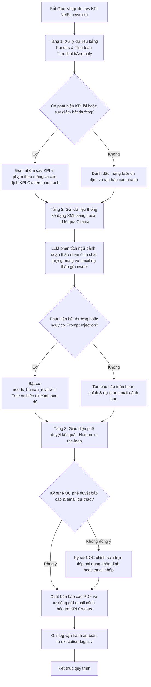

# Bản đặc tả luồng công việc logic (Logical Workflow Blueprint)

*   **Tên dự án ứng dụng:** Hệ thống Tự động hóa Báo cáo & Phân tích Anomaly KPI NetBI (NetBI-KARA)
*   **Tên nhóm thực hiện:** Nhóm 01 - AI Builders Viettel Net
*   **Đơn vị áp dụng:** Trung tâm Điều hành Mạng (NOC) - Tổng Công ty Mạng lưới Viettel (Viettel Net)

---

## 1. Sơ đồ khối quy trình (Logical Flowchart)

---

## 2. Mô tả chi tiết các bước trong luồng

### Bước 1: Tiếp nhận dữ liệu và Tính toán thống kê (Tầng Pandas)
*   **Đầu vào:** File Excel/CSV kết xuất từ hệ thống NetBI chứa 200 KPI của 6 mảng (Di động, cố định băng rộng, gián đoạn thông tin, CNTT, truyền tải, cơ điện).
*   **Hành động:** Sử dụng thư viện Pandas tính toán tự động:
    *   So sánh giá trị KPI tuần này với target thiết lập.
    *   Tính toán độ lệch chuẩn (z-score) so với trung bình 4 tuần lịch sử để phát hiện các KPI suy giảm bất thường (mặc dù chưa vượt ngưỡng target nhưng có xu hướng tụt dốc).
*   **Mục tiêu:** Thực hiện tiền xử lý dữ liệu số chính xác 100%, tạo tiền đề dữ liệu sạch cho LLM xử lý ngôn ngữ tự nhiên.

### Bước 2: Phân tích thông minh và Soạn thảo (Tầng Local LLM)
*   **Đầu vào:** Danh sách các KPI vi phạm hoặc suy giảm bất thường được định dạng dưới dạng XML có cấu trúc như `<kpi_anomalies>...</kpi_anomalies>`.
*   **Hành động:** Chuyển dữ liệu cấu trúc này sang Local LLM (`qwen3.5:7b-instruct` chạy offline qua Ollama) với các chỉ thị:
    *   Viết đoạn văn bản nhận định tình hình chất lượng mạng lưới trong tuần một cách khách quan, mạch lạc, bằng tiếng Việt.
    *   Tự động soạn thảo các bức thư cảnh báo gửi KPI owners, nêu rõ chỉ số bị suy giảm, trạm bị ảnh hưởng và yêu cầu phản hồi nguyên nhân, giải pháp.
*   **Ranh giới an toàn:** Tự động phát hiện các chuỗi dữ liệu đầu vào chứa các từ khóa lạ hoặc chỉ thị độc hại cố tình phá hoại cấu trúc (Prompt Injection). Nếu có, kích hoạt cờ cảnh báo.

### Bước 3: Kiểm duyệt và Hiệu chỉnh (Tầng Human-in-the-loop)
*   **Đầu vào:** Bản nháp báo cáo tuần và danh sách dự thảo email cảnh báo được hiển thị trên giao diện Web UI nội bộ.
*   **Hành động:** 
    *   Kỹ sư NOC đọc duyệt nội dung nhận định của AI.
    *   Nếu có chi tiết chưa chính xác hoặc email cần sửa từ ngữ, kỹ sư NOC thực hiện chỉnh sửa trực tiếp trên ô soạn thảo.
    *   Nhấn nút phê duyệt để hệ thống tiến hành xuất bản báo cáo PDF và gửi email qua hệ thống thư điện tử nội bộ của Viettel Net.

### Bước 4: Lưu trữ và Ghi nhật ký (Tầng Output & Logging)
*   **Đầu ra:** Báo cáo tuần PDF hoàn chỉnh lưu trên thư mục chia sẻ nội bộ. Các email cảnh báo được gửi đi.
*   **Ghi log:** Hệ thống tự động lưu trữ thông tin vận hành (Thời gian chạy, Tổng số KPI vi phạm, Số lượng email đã gửi, Trạng thái phê duyệt) vào tệp `execution-log.csv`. Báo cáo log tuyệt đối không lưu lại dữ liệu thô chi tiết để tránh rò rỉ.

---

## 3. Ranh giới Phân vai (Human-in-the-loop Boundaries)

Để đảm bảo an toàn tuyệt đối và tính chuyên nghiệp của hệ thống điều hành NOC:

*   **AI làm:** Tự động xử lý dữ liệu lớn, tính toán chỉ số, phát hiện anomaly, soạn thảo văn bản nhận định và viết nháp email trong vòng dưới 1 phút.
*   **Con người làm (Chốt chặn quyết định):** Đọc duyệt, hiệu chỉnh thông tin và ra quyết định gửi thư cảnh báo cho các bộ phận khác. Tuyệt đối không cho phép AI tự động gửi cảnh báo hoặc xuất bản báo cáo chính thức khi chưa có sự phê duyệt vật lý của kỹ sư trực ca NOC.
