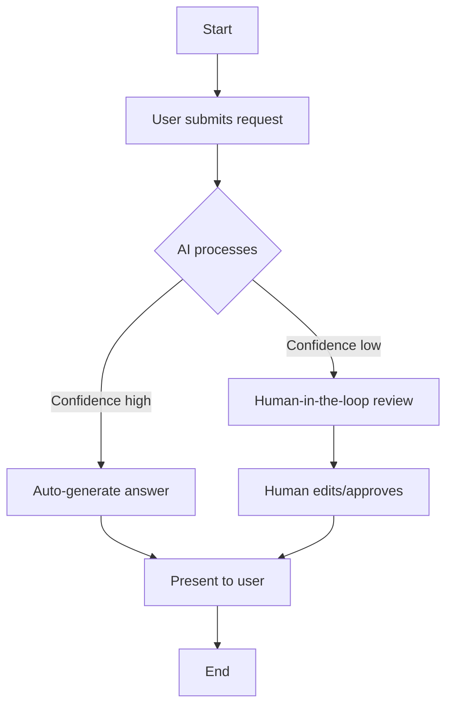

# Logical Workflow

> **Group:** Nhóm 06
> **Date:** tháng 7/2026

**Explanation**:
- The AI first attempts to answer the query.
- If the confidence score is above the threshold, the answer is returned directly.
- Otherwise, the request is routed to a human reviewer (PM) who validates, edits, and approves.
- All interactions are logged for audit purposes.
